# 迭代二文档说明

## 需求和功能说明

### 需求背景

农村志愿服务者在扶助困难群体、发展农业生产、促进邻里互助、倡导文明风尚、关怀儿童教育、协调矛盾冲突、保护生态环境等方面成为农村社会和谐稳定不可忽视的力量。但同时，由于乡村渠道受限、信息不畅，志愿者招募方式单一、范围小、质量低；受困管理机制的缺陷，志愿者积极性和持续性差。希望可以利用互联网工具，构建一个以政府为主导，机构为发起者，媒体为媒介，社区、高校、企业为响应者的新机制，重视招募的规范性并设立相应门槛，在管理层面完善机制。

### 主要功能：

1. 支持帐号登录体系，帐号登录、登出、注销等；
2. 支持发布志愿者征集需求，如文本描述、图片上传等；
3. 支持简单咨询，双方可进行交流，可传输文本、图片、音频、视频、文件等（可适当使用官方或外部组件实现该功能）；
4. 支持搜索，可按需求类型、地点等进行检索；

### 选做功能：

1. 志愿等级，鼓励志愿者多参加志愿活动，可获得更高等级与相应标识等功能；
2. 奖品兑换，鼓励志愿者多参加志愿活动，累积积分可以兑换奖品；
3. 支持签到打卡；
4. 支持订阅消息提醒。

### 用例图

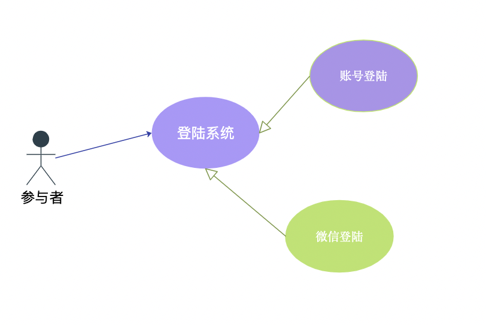

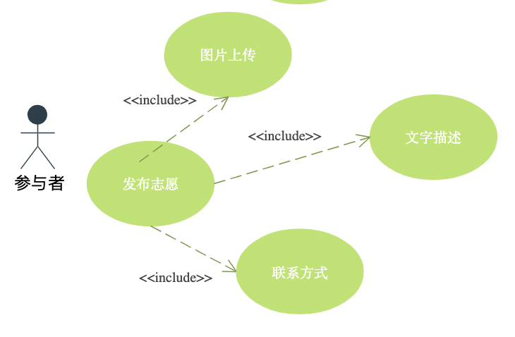

### 用例文字说明

小程序乡村志愿会有两种登陆模式，一种是微信登陆的静默登陆模式，一种是账号密码登陆

## 技术实现说明

### 软件架构

微信小程序

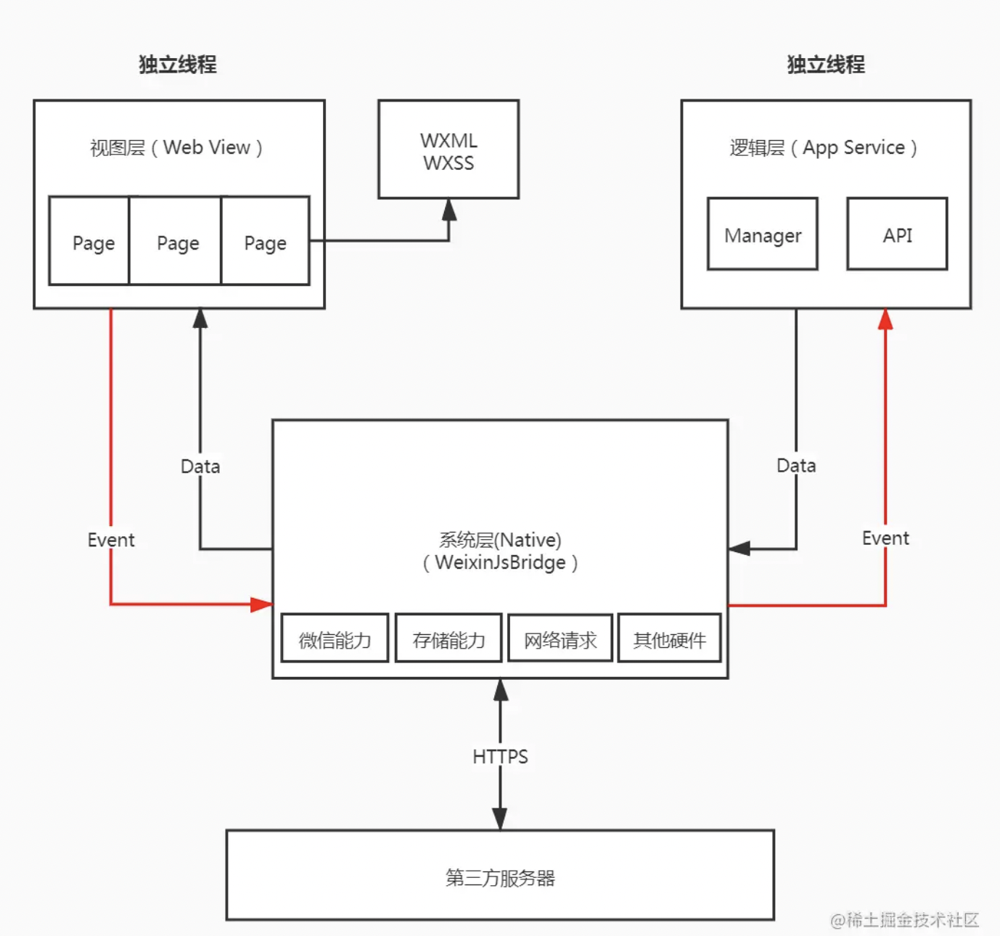

### 状态图

### 时序图

### 重点模块类图

## 产品实现说明

初次进入小程序，在注册界面输入用户名，账号和密码实现注册

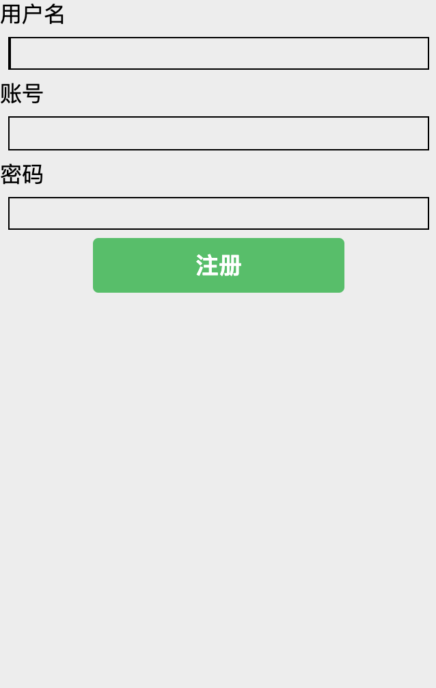

完成注册后，输入账号和密码实现登陆

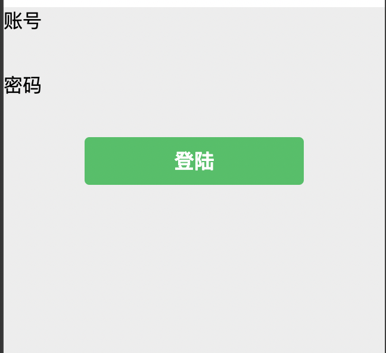

在大厅查看所有存在的志愿活动，可以进行搜索和标签筛选

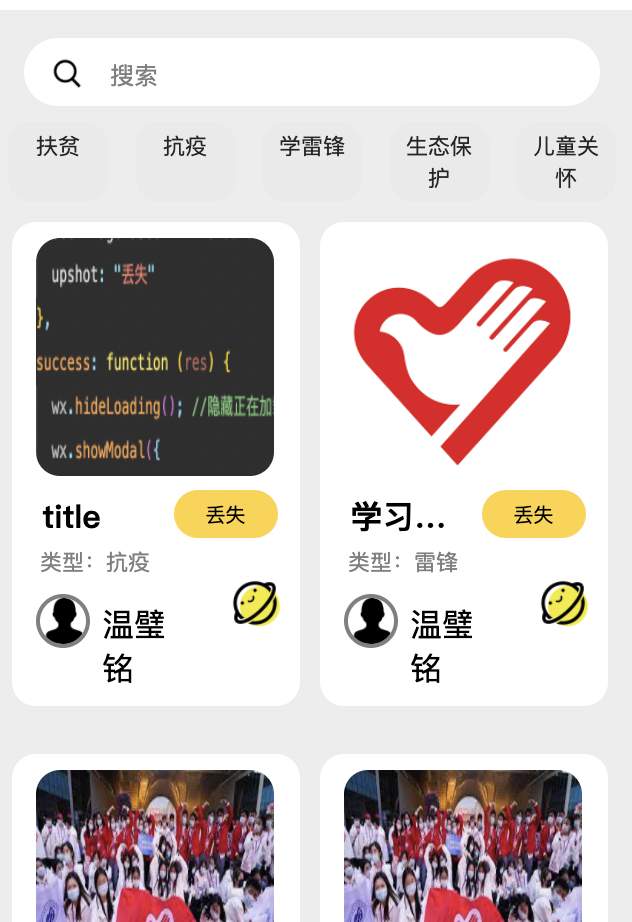

在发布栏发布志愿活动，选择输入标题和描述性文字

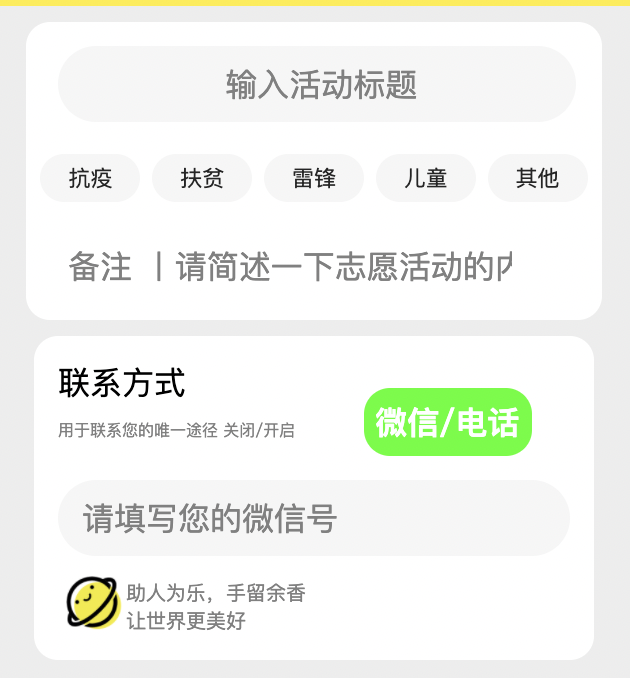

输入文字后，我们需要更详细的信息，比如联系方式和图片

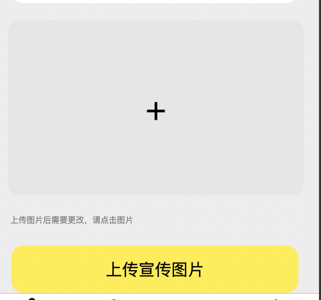

在活动大厅中，可以搜索想了解的志愿活动

活动大厅

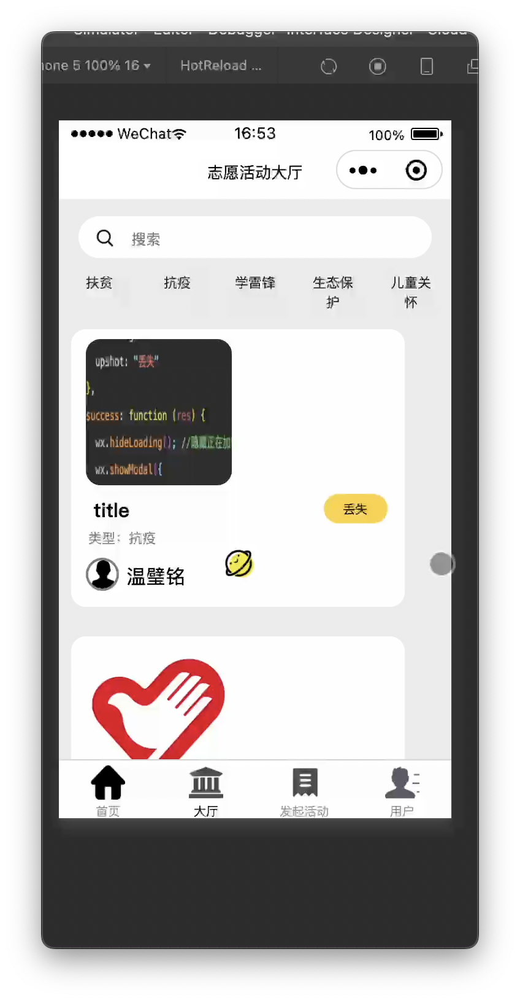

(出现图片不显示的bug, 后期将修复)

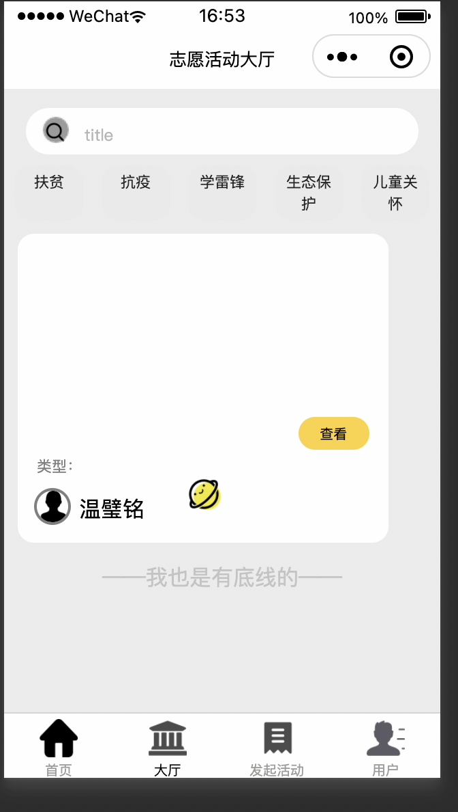

签到抽奖

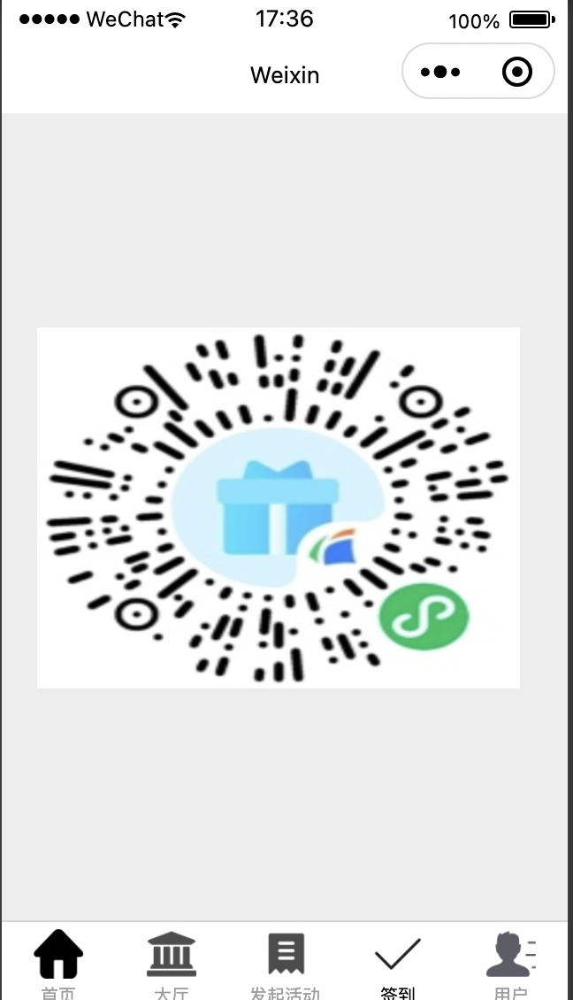

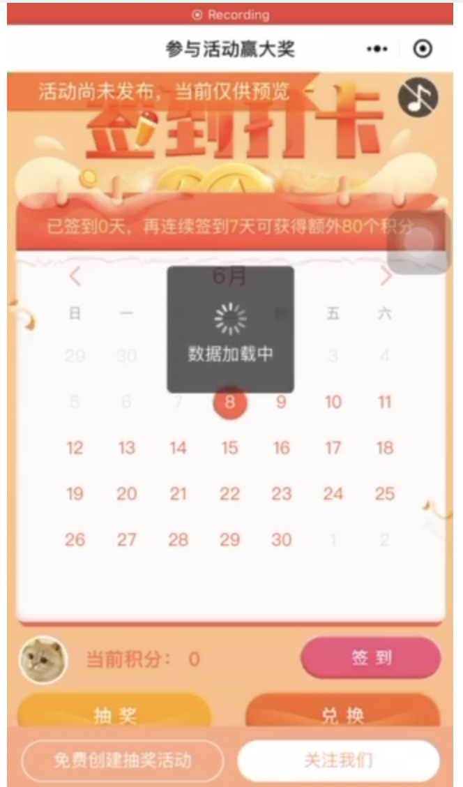