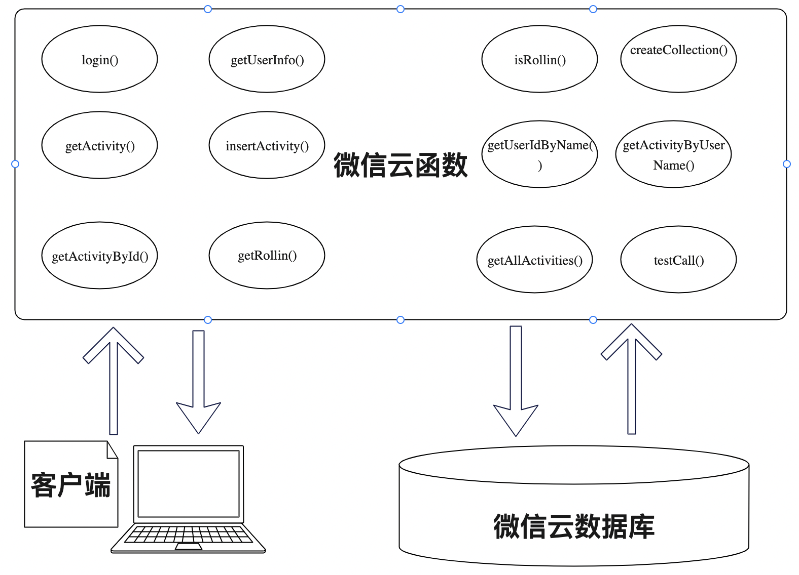
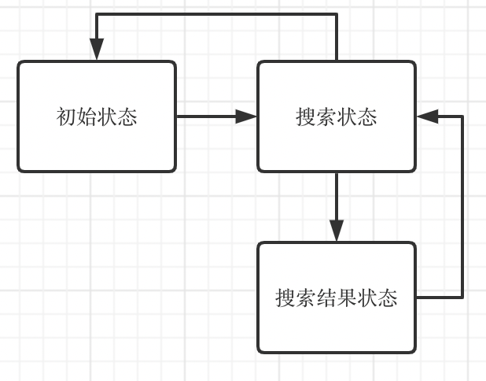

# 移动智能开发课程报告

姓名：温璧铭

学号：1913142

## 1 选题定位

农村志愿服务者在扶助困难群体、发展农业生产、促进邻里互助、倡导文明风尚、关怀儿童教育、协调矛盾冲突、保护生态环境等方面成为农村社会和谐稳定不可忽视的力量。但同时，由于乡村渠道受限、信息不畅，志愿者招募方式单一、范围小、质量低；受困管理机制的缺陷，志愿者积极性和持续性差。希望可以利用互联网工具，构建一个以政府为主导，机构为发起者，媒体为媒介，社区、高校、企业为响应者的新机制，重视招募的规范性并设立相应门槛，在管理层面完善机制。

## 2 需求分析

### 2.1核心功能一览

|   类别   | 描述                                                         | 序号 |
| :------: | ------------------------------------------------------------ | ---- |
| 用户管理 | 支持帐号登录体系，帐号登录、登出                             | 1    |
| 信息发布 | 支持发布志愿者征集需求，如文本描述、图片上传等               | 2    |
| 信息交流 | 支持简单咨询，双方可进行交流，可传输文本、图片、音频、视频、文件等） | 3    |
| 信息获取 | 支持搜索，可按需求类型、地点等进行检索                       | 4    |
|   标识   | 志愿等级，鼓励志愿者多参加志愿活动，可获得更高等级与相应标识等功能 | 5    |
|   奖励   | 鼓励志愿者多参加志愿活动，累积积分可以兑换奖品               | 6    |
| 上线激励 | 支持签到打卡                                                 | 7    |

### 2.1 用户故事

| 序号 | 内容                                                         |
| :--: | ------------------------------------------------------------ |
|  1   | 1. 用户进入注册/登录页面  2. 用户点击注册/登录按钮 3. 跳转至小程序主页 4. 用户点击个人主页栏 5. 用户点击退出登录按钮 6. 跳转至注册/登录界面 |
|  2   | 1. 用户点击小程序上传栏 2. 跳转至活动发布页面 3. 用户填入标题，时间等文字信息 4. 用户上传图片 5. 用户点击确认上传按钮 6. 跳转至小程序主页 |
|  3   | 1. 用户点击活动大厅中的活动项目 2. 跳转至志愿活动详情页 3. 用户点击询问按钮 4. 跳转至双人聊天室页面 5. 用户发送消息，上传图片 6. 用户点击返回按钮 7. 跳转至活动大厅 8. 用户点击消息栏 9. 跳转至会话记录页面 |
|  4   | 1. 用户点击活动大厅中的搜索按钮 2. 跳转至搜索页面 3. 用户键入搜索关键词 4. 跳转至搜索结果页面 5. 用户点击返回至搜索页面 6. 用户点击返回至活动大厅页面 |
|  5   | 1. 用户点击个人主页栏 2. 跳转至个人中心页面 3. 用户名右侧显示标签“青铜”或“白银”或”王者“ |
|  6   | 1. 用户点击个人主页栏 2. 跳转至个人中心页面 3. 用户点击兑换奖品 4. 显示奖品兑换成功提示 |
|  7   | 1. 用户点击个人主页栏 2. 跳转至个人中心页面 3. 用户点击 4. 显示奖品兑换成功提示 |

## 3 产品设计

### 3.1 外观设计

* 配色：采用同微信移动端灰白色为背景，纯白色为内容和组件的配色
* 字体：主体部分的文本使用14rpx大小的字体

### 3.2 用户交互图

### 3.3 项目核心页面展示

|         名称         |                        图片                        |
| :------------------: | :------------------------------------------------: |
| **活动大厅（主页）** |          |
|       **上传**       |        |
|     **活动详情**     |      |
|       **消息**       |  |
|      **聊天室**      |          |
|      **个人页**      |      |
|     **登陆注册**     |         |

## 4 技术实现

### 4.1 系统架构

### 4.2 应用架构

本项目充分结合微信小程序的优势，使用了传统的MVC架构，分为

* 前端（微信客户端）
  * view层，页面渲染功能，负责向展示页面
  * controller层，业务层，负责数据的处理和具体业务逻辑的实现
* 后端
  * 微信云函数，接受前端的请求，实现大部分的业务逻辑，调用云数据库提供的接口，讲数据返回给前端
  * 微信云数据库，数据记录实际存储的位置，提供增删查改接口

### 4.3 功能模块

* 基础信息

  * 技术选型：Javascript ｜XML标记语言｜ Node.js 
  * 第三方组件：Vant-Weapp 组件库
  * 第三方SDK: 腾讯Tim即时通讯SDK
  * 数据库：小程序原生Collection

* 具体功能模块
  * 主页（活动大厅）
    * 主页划分为搜索框，轮播图和活动列表三个部分
    * 

    * 
主页类图

  * 登录注册
		* 

		* 
登录验证时序图

  * 活动上传
    * 

    * 
活动上传类图

  * 通信
    * 

    * 
通讯模块流程图

  * 搜索
    * 

    * 
搜索模块状态图

### 

